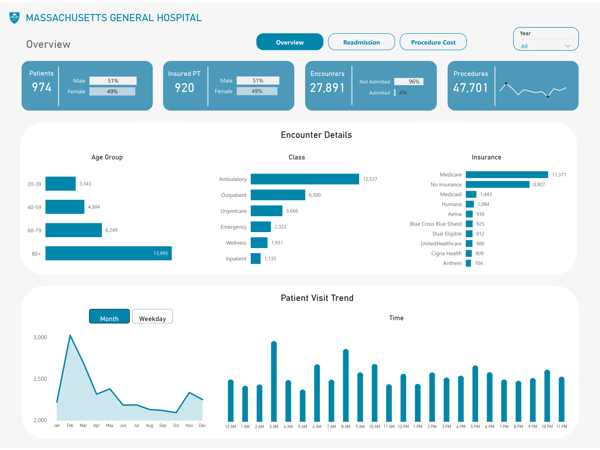
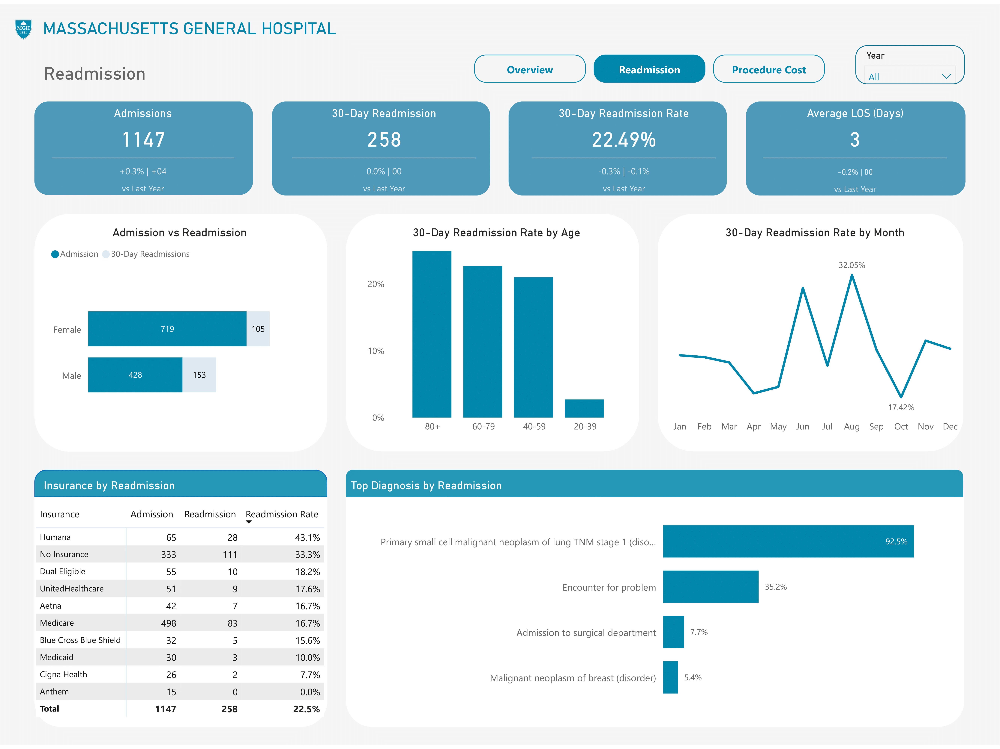
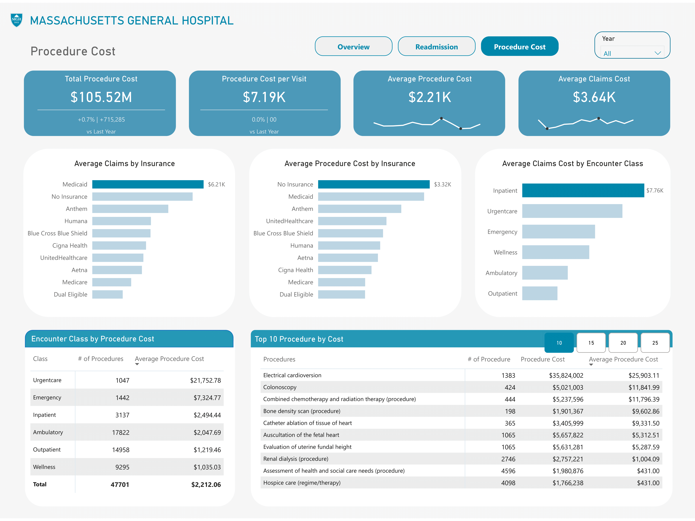

# Massachusetts General Hospital Analysis

## Executive Summary

Using Power BI, I analysed patient records and built reports to track readmission rates and the cost of procedures. 
Insights from these reports will help to identify trends, address performance gaps, and enhance overall patient outcomes and operational efficiencies.

### Problem Statement

The purpose of the report is to give stakeholders visibility into the hospital’s recent performance, and answer the following questions:

1. How many patients have been admitted or readmitted over time?
2. How long are patients staying in the hospital, on average?
3. How much is the average procedure cost per visit?

The dashboard should scale to accommodate new data over time, but the CEO has also asked to summarize any insights from patient visits.

### Analysis Approach

After carefully reviewing the problem statement my analysis was shaped with a clear objective – provide stakeholders with insights into the hospital's performance by analysing patient admissions and readmissions, average length of stay, and average procedure costs per visit. 
I focused on key insights affecting admission, readmission and procedure cost. These metrics will help track hospital demand, capacity and effectiveness of care. 
These would also help assess pricing strategies and insurance reimbursements. And the cost of patient visits.  

### About the Dataset
The dataset used is synthetic data on ~1k patients of Massachusetts General Hospital from 2011-2022, which includes information on patient demographics, insurance coverage, and medical encounters & procedures. 
It consists of 5 tables, including Encounters, Organizations, Patients, Payers and procedures. All tables contain 75,592 rows and 55 columns together.  It was downloaded from Maven Playground.

### Methodology

Although the data required minimal cleaning, establishing an efficient data model was crucial to improving performance and optimizing the report generation process. 
The data consists of two fact tables, encounter and procedure. For a clean star schema model, I could have preferred just a fact table which is the encounter table. 
Upon further review, I decided to stick with the two fact tables. They both show a distinct event with datetime. 
For the dimension table, only the specific columns relevant to that dimension were retained. 
This step helped streamline the dataset and ensure that each table contained only the information necessary for analysis.

**Transforming the data**: I created new columns like age, age group, length of stay, Admission, Time of encounter, and hour of each encounter visit for my analysis. 

For admission, data showed that visits under different encounter classes had overnight stays. So, I assumed admission is not limited to only inpatient and emergency classes. I created Admission columns based on the days in the hospital rather than only the encounter classes.

`ReasonDescription` column consists of nulls. This means that those encounters didn’t target a specific condition, so I created another column and replaced all null values with the description for encounters.

**Creating a Date Table**: One crucial step of the process was building a Date Table. Using DAX (Data Analysis Expressions), I created an accurate Date Table that enabled effective time series analysis, making it easier to track trends over time.

**Star Schema Data Modeling**: With both my Dimension and Fact Tables in place, the next step was data modeling. I established relationships between tables by connecting the primary keys in the dimension tables to the foreign keys in the Fact Table. 

### Analysis

Once the data was in place, the next challenge was designing a dashboard that would deliver actionable insights at a glance. Since the report is for stakeholders, I focused on delivering high-level summaries. 
I broke down the analysis into Encounters details, Admission and Readmission, and Procedures.

Based on the questions I am to answer, I used metrics like:

- 30-Day Readmission Rate: The percentage of patients readmitted to the hospital within 30 days after discharge.
- Average Length of Stay: The average time patients spend in the hospital per admission.
- Procedure Cost per Visit: The average cost of procedures for a single visit
  
I added a navigation bar to allow users to effortlessly switch between the different pages of the report, each focusing on encounter details, readmission and procedure cost. 
I also added a Year slicer to let users look at trends for different years.

**Overview Page**

Since the CEO has asked me to summarize any insights from patient visits. I created an overview page showing encounters and visit trends. 
This report provides a snapshot of metrics relating to patient encounters. 
A patient visit chart was added where users could toggle between monthly and weekly trends to see how these metrics changed throughout the year.

**Readmission**

I focused on readmissions within 30 days of discharge by patient demographics, month, insurance and diagnoses. 
The 30-day readmission rate is a widely accepted metric in healthcare. 
To get a comprehensive analysis of the readmission rate, I took into consideration the number of admissions vs readmissions. Some of the KPI shows changes from the previous year.

**Procedure Cost**

This page shows the breakdown of the cost of procedures by different metrics including Encounter class, insurance and procedures type. 
Some of the KPI shows changes from the previous year. 

### Key Insights Summary

These summaries give overall trends and patterns for the years 2011 to 2022.

1. Encounters: There are a total of 27,891 encounters recorded, with a high rate of non-admissions (96%). Only 4% of encounters result in patient admission.
The majority of patients who visited the hospital fall into the 80+ age group, with 14,000 patients, followed by the 60-79 age group with 6,200 patients.
The most common type of encounter is ambulatory care (12,537).
The majority of patients are covered by Medicare (11,371), followed by a significant number of patients with no insurance (8,807).

2. Visit Trends: Monthly visits peak in February and gradually decline throughout the year, with a slight increase in November and a dip in December.
Patient visits peak in the middle of the week, specifically on Wednesday, and gradually decrease towards the weekend.
The highest number of visits occurs in the early morning hours, particularly between 3 AM and 8 AM. 

3. Readmission: Male patients have a significantly higher readmission rate compared to female patients.
Out of 428 male admissions, 153 (35.7%) led to readmissions, while female patients had a readmission rate of 14.6% (105 out of 719 admissions).
The highest readmission rate is observed among patients aged 80+, with over 30% of this group being readmitted within 30 days.
Humana patients have the highest readmission rate at 43.1%, followed by No Insurance patients at 33.3% and Medicare at 16.7%. 
The primary diagnosis driving readmissions is Primary small cell malignant neoplasm of the lung (TNM stage 1), with a readmission rate of 92.5%.

5. Procedure Cost: Urgent care has the highest average procedure cost at $21.75K, followed by Emergency at $7.32K. Wellness and Outpatient encounters have the lowest average procedure costs, at $1,035.03 and $1,219.46, respectively.
There is a notable variation in cost between different procedures, with some high-frequency procedures like Wellness being much less expensive than urgent or emergency interventions. The most expensive procedures include Electrical cardioversion ($25.9K per procedure) and Colonoscopy ($11.8K per procedure), with a significant number of procedures conducted annually.

### Recommendations

1.	Enhance Geriatric Services: Since the 80+ age group is the largest patient population, consider expanding geriatric services and support for chronic conditions prevalent in older adults. The group also has the highest readmission rates. Implementing specialized post-discharge care programs for the elderly, such as home health services, frequent follow-ups, or remote monitoring, will prevent readmissions in this high-risk population.
2.	Optimize Resource Allocation: With ambulatory services being the most frequently used, ensure adequate staffing, resources, and facilities to handle this demand efficiently. The peak in early morning visits suggests a need for optimized scheduling and resource allocation during these hours to manage the patient load effectively. It might be beneficial to adjust staffing levels to ensure adequate coverage during these hours, especially in urgent care and emergency services
3.	Address the Uninsured Population: A significant number of patients visiting lack insurance coverage. The hospital could focus on financial assistance programs, partnerships with local organizations, or patient education to reduce the burden of healthcare costs for these individuals.
4.	Targeted Humana and Uninsured Patients Interventions: The Humana and No Insurance groups have the highest readmission rates. For Humana patients, negotiate with insurers to better support aftercare. For No Insurance patients, providing enhanced support such as follow-up clinics or community-based care might reduce readmissions, especially for complex cases.
5.	Diagnosis-Specific Interventions: Small cell lung cancer patients are at high risk for readmission. Implement more intensive post-discharge follow-up and monitoring programs specifically for oncology patients. Addressing their specific needs early could prevent complications that lead to readmissions. 
6.	Preventive Care Emphasis: Urgent care and Emergency encounters are the most expensive per procedure. Focus on reducing unnecessary urgent or emergency procedures through preventive care or better patient education. Wellness and Outpatient procedures, which have lower costs, should be encouraged to reduce the need for expensive 
7.	Cost Management for High-Cost Procedures: Electrical cardioversion and Colonoscopy have high per-procedure costs; explore negotiations with suppliers or alternative procedural methods to reduce costs.

I believe these recommendations would help the hospital reduce readmissions, improve patient outcomes, and optimize resource allocation while driving cost optimisation.

### Recommended Analysis

1.	Analyse Admission Processes: With only 4% of encounters resulting in admission, a review of the criteria and processes for admissions might help improve efficiency and ensure that patients who need in-patient care receive it promptly.
2.	Analyse Metrics by Departments: Metrics like Average Length of stay and readmission by department are important in understanding hospital performance.
